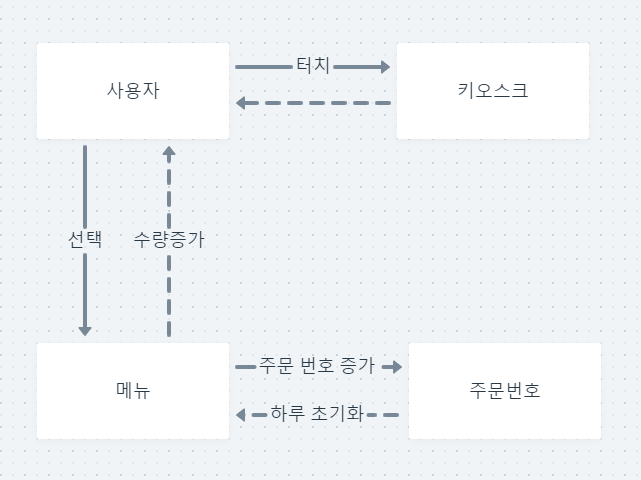

# 프로젝트 소개
- 카페에서 키오스크로 주문하는 프로그램

# 시스템 요구사항
1. 사용자는 키오스크를 통해 매장에서 먹을 것인지 포장해 가는지 선택할 수 있다.
2. 사용자는 음zldh료를 카테고리 별로 고를 수 있다.
3. 카테고리는 에스프레소 음료, 티, 에이드, 푸드 및 베이커리가 있다.
4. 에스프레소 음료에는 에스프레소, 아메리카노, 마끼아또, 코르타도, 카푸치노, 플랫화이트, 라떼가 있습니다.
5. 차에는 녹차, 허브티, 레몬밤티, 카모마일이 있습니다.
6. 에이드에는 블루레몬에이드, 라임에이드, 상그리아에이드, 오렌지에이드가 있습니다.
7. 결제는 현금 또는 카드로 결제할 수 있습니다.
8. 결제가 완료되면 주문 번호가 나옵니다.
9. 주문 번호는 하루마다 갱신됩니다.

# 커뮤니케이션 다이어그램

[Link](https://whimsical.com/4npk6X1WPMDfExPY8Jy1sx)
